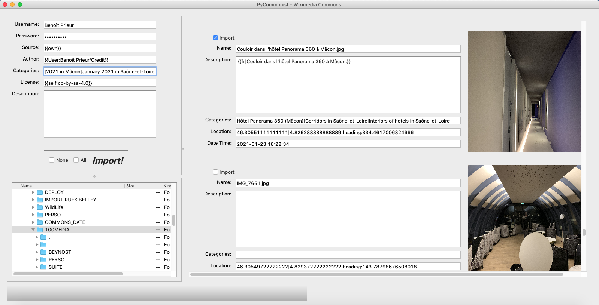

# PyCommonist

PyCommonist est codé en Python/PyQt. Il est très largement inspiré de l'excellent logiciel [Commonist](https://commons.wikimedia.org/wiki/Commons:Commonist/fr). Il permet de téléverser facilement des photographies vers Wikimedia Commons.

Pour l'installer et le lancer (utilisation ici d'un environnement virtuel) :
* `git clone https://github.com/benprieur/PyCommonist.git`
* `cd PyCommonist`
* `virtualenv venv`
* `source venv/bin/activate`
* `pip install -r requirements.txt`
* `python3 main.py`

Au 26 janvier 2021, il a été testé sur MacOS et sur Linux Ubuntu. Ci-dessous une copie d'écran à cette date.

Dernières améliorations :

* 20 avril 2021 : ajout d'un fichier externe de configuration (largement inspiré par le code de User:Deansfa, merci à lui).
* 2 mai 2021 : ajout d'une auto-suggestion des catégories (idée de User:Romainbar, merci à lui).
* 12 mai 2021 : User:Romainbar
 * support des adresses copiées depuis OSM
 * si la case des catégories par défaut est vide, la ligne n'est pas créée dans la page
 * ajout du code langue pour la description

